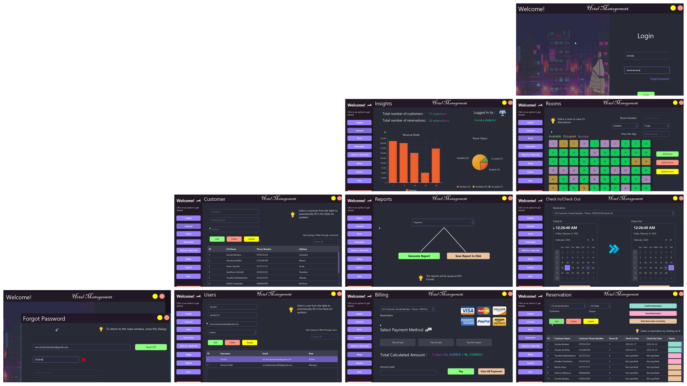

# FX Hotel

**FX-Hotel** is a Java-based desktop application designed 
to electrify hotel management operations. Built with 
JavaFX and utilizing a MySQL database with Hibernate ORM,
this application offers a user-friendly interface
and robust functionality to manage a lot of aspects in hotel management efficiently.

**Check Out this LinkedIn post for a video demonstration** :

- [FX Hotel LinkedIn Video Demonstration](https://www.linkedin.com/posts/senuka-bandara_javafx-hotelmanagement-softwaredevelopment-activity-7299145057146650624-L1Sb?utm_source=share&utm_medium=member_desktop&rcm=ACoAAEyDwdUBST_6x2xhy26-f-nyYDZ9yJu73Ms)

## Features

- [x] Login / User Authentication
- [x] Reset Password with OTP verification
- [x] Insights (charts, visualizations)
- [x] Customer Management
- [x] Room Management
- [x] Reservation Management
- [x] Check-In / Check-Out Management
- [x] Billing / Payment Management
- [x] Report Generation & saving
- [x] User Management

## Screenshots



## Tools & Libraries Used

* JavaFX
* Lombok
* MySQL Connector
* Hibernate
* AtlantaFX
* Model Mapper
* Guice
* Jasper Reports
* Jakarta Mail
* IntelliJ IDEA

## Prerequisites Before Running

`secrets.properties` file.

```properties
email=your_google_email@gmail.com
password=your_app_password
```

This file should be located at `/resources/`